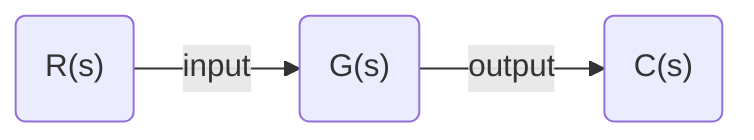

# Routh-Hurwitz Criterion

系统稳定的充分必要条件是：劳斯表中第一列所有元素的计算值均大于零。

* 如果第一列中出现一个小于零的值，系统就不稳定；
* 如果第一列中有等于零的值，说明系统处于临界稳定状态；
* 第一列中数据符号改变的次数等于系统特征方程正实部根的数目，即系统中不稳定根的个数。

It tells us how many closed-loop system poles are there

in the left half-plane, in the right half-plane, and on the jω-axis.

example 1:



$$
G(s) = \frac{N(s)}{a_{4} s^{4}+a_{3} s^{3}+a_{2} s^{2}+a_{1} s+a_{0}}
$$

here is Routh table:
$$
\begin{array}{l}
{s^{4} \quad a_{4} \quad a_{2} \quad a_{0}} \\ 
{s^{3} \quad a_{3}} \quad {a_{1} \quad 0} \\ 
{s^{2}} \quad \frac{-\left|\begin{array}{ll}{a_{4}} & {a_{2}} \\ {a_{3}} & {a_{1}}\end{array}\right|}{a_{3}}=b_{1} \quad \frac{-\left|\begin{array}{ll}{a_{4}} & {a_{0}} \\ {a_{3}} & {0}\end{array}\right|}{a_3}=b_{2} \quad \frac{-\left|\begin{array}{ll}{a_{4}} & {0} \\ {a_{3}} & {0}\end{array}\right|}{a_{3}}=0\\ 
s^{1} \quad \frac{-\left|\begin{array}{ll}{a_{3}} & {a_{1}} \\ {b_{1}} & {b_{2}}\end{array}\right|}{b_{1}}=c_{1} \quad \quad \frac{-\left|\begin{array}{ll}{a_{3}} & {0} \\ {b_{1}} & {0}\end{array}\right|}{b_{1}}=0 \quad \frac{-\left|\begin{array}{ll}{a_{3}} & {0} \\ {b_{1}} & {0}\end{array}\right|}{b_{1}}=0 \\ 
s^{0} \quad \frac{-\left|\begin{array}{cc}{b_{1}} & {b_{2}} \\ {c_{1}} & {0}\end{array}\right|}{c_1}=d_{1} \quad \frac{-\left|\begin{array}{cc}{b_{1}} & {0} \\ {c_{1}} & {0}\end{array}\right|}{c_{1}}=0 \quad \quad \frac{-\left|\begin{array}{cc}{b_{1}} & {0} \\ {c_{1}} & {0}\end{array}\right|}{c_{1}}=0
\end{array}
$$

#### (a) if Zero Only in the First Column

If the first element of a row is zero, division by zero would be required to form the next row. To avoid this phenomenon, an epsilon, ε, is assigned to replace the zero in the first column. 

The value ε is then allowed to approach zero from either the positive or the negative side, after which the signs of the entries in the first column can be determined.
$$
T(s)=\frac{10}{s^{5}+2 s^{4}+3 s^{3}+6 s^{2}+5 s+3}
$$
用一个小正数代替零元素继续列表

Routh Table:
$$
\begin{array}{llll}
\hline
{s^{5}} & {1} & {3} & {5} \\ 
{s^{4}} & {2} & {6} & {3} \\ 
{s^{3}} & {\epsilon} & {\frac{7}{2}} & {0} \\ 
{s^{2}} & {\frac{6 \epsilon-7}{\epsilon}} & {3} & {0} \\ 
{s^{1}} & {\frac{42 \epsilon-49-6 \epsilon^{2}}{12 \epsilon-14}} & {0} & {0} \\
\hline
\end{array}
$$


then consider the first column of Routh table
$$
\begin{array}{|c|c|c|}
\hline \text { Label } & {\text { First column }} & {\epsilon=+} & {\epsilon=-} \\ 
\hline s^{5} & {1} & {+} & {+} \\ 
{s^{4}} & {2} & {+} & {+} \\ 
{s^{3}} & {\epsilon} & {+} & {-} \\ 
{s^{2}} & {\frac{6 \epsilon-7}{\epsilon}} & {-} & {+} \\
{s^{1}} & {\frac{42 \epsilon-49-6 \epsilon^{2}}{12 \epsilon-14}}& {+} & {+} \\ 
{s^{0}} & {3} & {+} & {+} \\ 
\hline
\end{array}
$$

#### (b) Entire Row is Zero

We now look at the second special case. Sometimes while making a Routh table, we find
that an entire row consists of zeros

出现全0行=>方程中有

一对大小相等、符号相反的实根，

或一对纯虚根，

或对称于s平面原点的共轭复根。

This symmetry can occur under three conditions of root position:
(1) The roots are symmetrical and real, 

(2) the roots are symmetrical and imaginary, or 

(3) the roots are quadrantal. (四个共轭，对称的根)

列表时先用全零行的上一行构成辅助方程，它的根就是原方程的特殊根。

再将辅助方程求导，用求导后的方程代替全零行

继续下去直到得到全部劳思表

### MATLAB code

to find the closed-loop transfer function, T(s), and the closed-loop poles.

```matlab
numg = 128;
deng = [1 3 10 24 ...
		48 96 128 192 0];
G = tf(numg, deng);
T = feedback(G, 1); % T(s) = G(s) / [1 + G(s)]
poles = pole(T)
```


