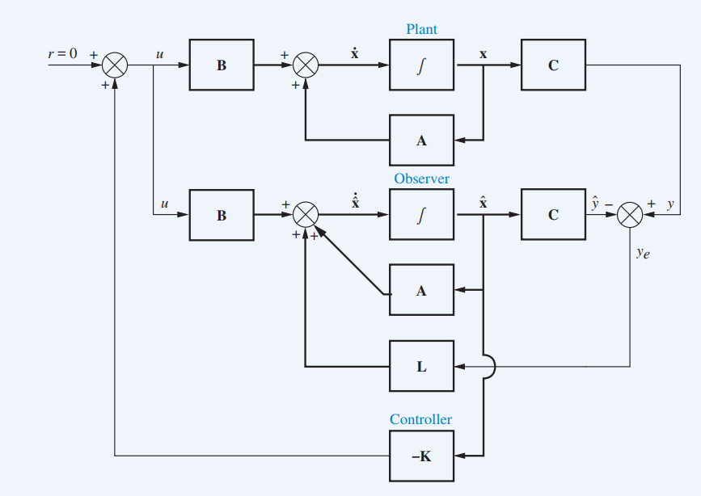
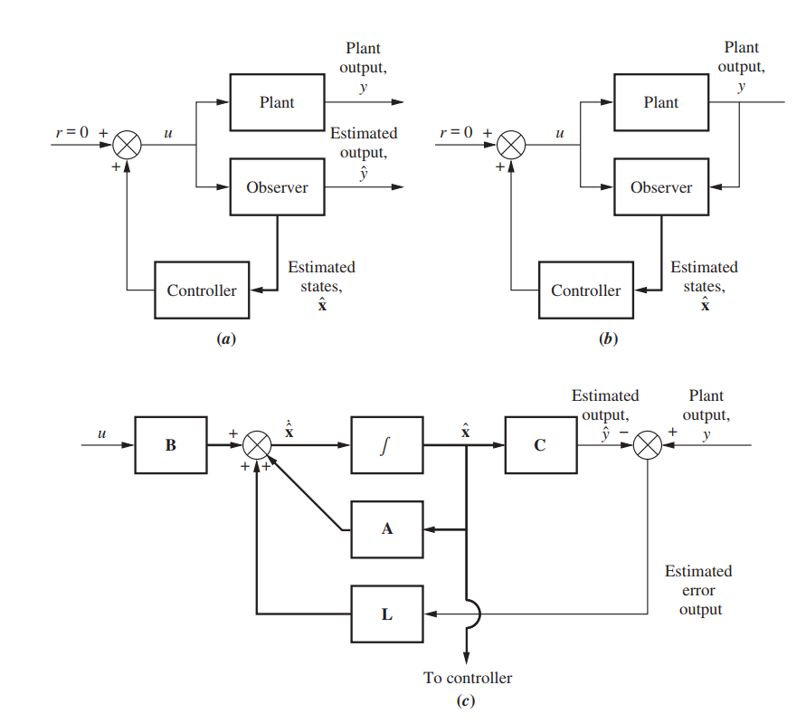
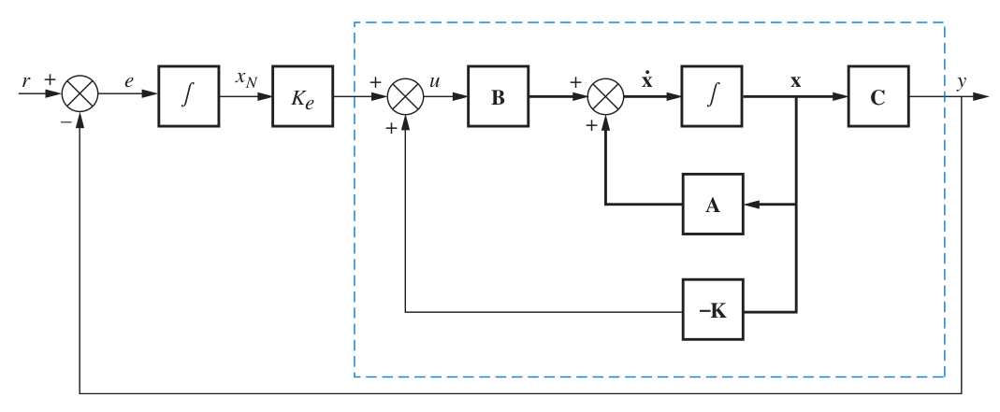

# Design Via State Space
<!--more-->

## Controllability

The basic equation set: (D alaways = 0)
$$
\dot{X} = A X + B U\\
Y = C X + D
$$
Introduce the Controller K always 1xN, \
where U always 1x1
$$
U = r - KX
$$
So, we obtain
$$
\dot{X} = AX + B(r - K U) = (A-BK)X + Br
$$
if we could manipulate th poles of $|sI- (A-BK)|$
Thus means
$$
Y = C \mathbb{L^{-1}}[(sI - (A-BK))^{-1}] * \mathbb{L^{-1}}[BR(s)]
$$
### Transformation
Here
$$Z = PX$$
We have
$$
\dot{Z} = AZ + BU \\
Y = C Z\\
U = r - KZ
$$
Thus
$$
\dot{X} = P^{-1}APX + P^{-1}BU\\
Y = CPX\\
U = r - KPX
$$
Compare with
$$
\dot{X} = A_x X + B_x U\\
Y = C_x X\\
U = r - K_x X
$$

So we obtain
$$
A_x = P^{-1}AP\\
B_x = P^{-1}B\\
C_x = CP\\
K_x = KP
$$
Then we have
$$
C_{Mx} = [B_x \space A_xB_x \cdots A_x^{N-1}B_x] = P^{-1}C_{Mz}
$$
where X is observer canonical form\
Z is other form (like phase variable form, cascade form)
$$
P = C_{Mz}C_{Mx}^{-1}\

K_z = K_xP^{-1}
$$

## Observability

$$
\dot{\hat{X}} = A \hat{X} + BU + L(Y - \hat{Y})\\
\hat{Y} = C \hat{X}
$$

so with
$$
\dot{X} = A X + B U\\
Y = C X
$$

then obtain
$$
\dot{X} - \dot{\hat{X}} = A(X - \hat{X}) - LC(X- \hat{X})\\
=(A-LC) (X - \hat{X})
$$
define $e_X \equiv (X - \hat{X})$, we have
$$
\dot{e}_X = (A-LC) e_X
$$

If all poles of (A-LC) in the left plane
$$
\lim_{t\to \infty} e_X = (X - \hat{X}) = 0
$$
Then we could use $\hat{X}$ to estimate $X$\
regardless the influence of initial value $\hat{X}(0)$ and $X(0)$
### Transformation
$$Z = PX$$
where X is observer canonical form\
Z is other form (like phase variable form, cascade form)
$$
(\dot{Z} - \dot{\hat{Z}}) = (A-LC)(Z - \hat{Z})
$$

Then we have
$$
(\dot{X} - \dot{\hat{X}}) = P^{-1}(A-LC)P(X - \hat{X})
$$

So we have:
$$
A_x = P^{-1}AP\\
B_x = P^{-1}B\\
C_x = CP\\
L_x = P^{-1}L
$$

Now calculate $O_{Mx}$
$$
O_{Mx} = \begin{bmatrix}
C_x\\ C_xA_x\\ \vdots\\ C_xA_x^{N-1}
\end{bmatrix} = O_{Mz} P
$$

So, in conclusion:
$$
P = O_{Mz}^{-1}O_{Mx}\

L_z = PL_x
$$

## Integral Control with 0 Steady-State Error

$$
U = V - KX\\
\frac{(R-Y)}{s} K_e =X_N K_e =  V \equiv \frac{Y}{T(s)}
$$
So
$$
\frac{Y}{R} = \frac{K_e \frac{T(s)}{s}}{1+K_e \frac{T(s)}{s}}
$$
Then

$$
e_{ss} = \lim_{s\to 0+} sR(s) (1 - \frac{Y(s)}{R(s)})\\
= \lim_{s\to 0+} \frac{1}{1+K_e \frac{T(s)}{s}}\\
= \lim_{s\to 0+} \frac{s}{s+K_e T(s)} = 0
$$

since
$$
\dot{x}_{N}=R- Y = R- CX = [-C \space 0]
\begin{bmatrix}
X \\ x_N
\end{bmatrix} + R
$$

so
$$
\begin{bmatrix}
\dot{X} \\ \dot{x}_N
\end{bmatrix}=
\begin{bmatrix}
A & 0\\
-C & 0
\end{bmatrix}
\begin{bmatrix}
X \\ x_N
\end{bmatrix}+
\begin{bmatrix}
B \\ 0
\end{bmatrix}U+
\begin{bmatrix}
0 \\ 1
\end{bmatrix}R
$$

since
$$
U = K_e x_N - K X=[-K\space K_e]

\begin{bmatrix}

X \\ x_N

\end{bmatrix}
$$
we obtain
$$
\begin{bmatrix}
\dot{X} \\ \dot{x}_N
\end{bmatrix}=(
\begin{bmatrix}
A & 0\\
-C & 0
\end{bmatrix}+
\begin{bmatrix}
B \\ 0
\end{bmatrix}
[-K\space K_e]
)
\begin{bmatrix}
X \\ x_N
\end{bmatrix}+
\begin{bmatrix}
0 \\ 1
\end{bmatrix}R\\

=\begin{bmatrix}
A-BK & BK_e\\
-C & 0
\end{bmatrix}
\begin{bmatrix}
X \\ x_N
\end{bmatrix}+
\begin{bmatrix}
0 \\ 1
\end{bmatrix}R
$$

## Why zero of T(s) Not change with Controller
we know
$$
G(s) = \frac{C \text{adj}(sI - A)B}{|sI - A|}\\
T(s) = \frac{C \text{adj}(sI - A + BK)B}{|sI - A + BK|}
$$
why the numurator of G(S), T(s) is the same, because $\forall C$, so must prove
$$
\text{adj}(sI - A)B = \text{adj}(sI - A + BK)B
$$
that is mean $\forall A$ (replace sI-A with A)
$$
\text{adj}(A)B = \text{adj}(A + BK)B
$$
### lemma: Cramer's Rule
for $AX = B$, where
$$
X = \begin{bmatrix}
x_1\\
\vdots\\
x_i\\
\vdots\\
x_N
\end{bmatrix}
$$
We have
$$
X = A^{-1}B = \frac{\text{adj}(A)B}{|A|} = \frac{|A \stackrel{i}{\leftarrow} B|\text{for } x_i}{|A|}\\
x_i |A| = \text{adj}(A)B \quad \text{ith element}= |A \stackrel{i}{\leftarrow} B|
$$
Here
$$
A =\left(\mathbf{a}_{1} \cdots \mathbf{a}_{n}\right)\\
\left(A^{i} \leftarrow B\right) \stackrel{\text { def }}{=}\left(\begin{array}{llllll}{\mathbf{a}_{1}} & {\cdots} & {\mathbf{a}_{i-1}} & B & {\mathbf{a}_{i+1}} & {\cdots} & {\left.\mathbf{a}_{n}\right)}\end{array}\right.
$$

### proof
$$
\text{adj}(A+BK)B \quad \text{ith element}
= |(A+BK) \stackrel{i}{\leftarrow} B|\\
= \left|\begin{array}{llllll}{\mathbf{a}_{1}}+k_1B & {\cdots} & {\mathbf{a}_{i-1}}+k_{i-1}B & B & {\cdots} & {\mathbf{a}_{N}+k_NB}|\end{array}\right.\\
= \left|\begin{array}{llllll}{\mathbf{a}_{1}} & {\cdots} & {\mathbf{a}_{i-1}} & B & {\cdots} & {\mathbf{a}_{N}}|\end{array}\right.\\
= |A \stackrel{i}{\leftarrow} B| 
= \text{adj}(A)B \quad \text{ith element}\\
$$

### Another rule $|A+BK| = |A| + K\text{adj}(A)B$
$$
|A+BK| = \left|\begin{array}{llllll}{\mathbf{a}_{1}}+k_1B & {\cdots} & {\mathbf{a}_{i}}+k_{i}B & {\cdots} & {\mathbf{a}_{N}+k_NB}|\end{array}\right.\\
= \left|\begin{array}{llllll}{\mathbf{a}_{1}} & {\cdots} & {\mathbf{a}_{i-1}} & {\cdots} & {\mathbf{a}_{N}}|\end{array}\right. \\
+ \sum_i k_i \left|\begin{array}{llllll}{\mathbf{a}_{1}} & {\cdots} & {\mathbf{a}_{i-1}} & B & {\cdots} & {\mathbf{a}_{N}}|\end{array}\right.\\
= |A| + \sum_i k_i \space [\text{adj}(A)B \quad \text{ith element}]\\
= |A| + K \text{adj}(A)B
$$

### Conclusion
$$
G(s) = \frac{C \text{adj}(sI - A)B}{|sI - A|}
= \frac{N(s)}{D_1(s)}\\
T(s) = \frac{C \text{adj}(sI - A + BK)B}{|sI - A + BK|}\\
= \frac{C \text{adj}(sI - A)B}{|sI - A| + K \text{adj}(sI-A)B} = \frac{N(s)}{D_2(s)}
$$
if we introduce $K_e$
$$
\frac{Y(s)}{R(s)} \equiv T'(s) = \frac{K_e \frac{T(s)}{s}}{1+K_e \frac{T(s)}{s}}\\
= \frac{K_e N(s)}{sD_2(s) + K_e N(s)}
$$
even though we have introduced $K$ and $K_e$, zeros of $T(s)$ wouldn't be changed

