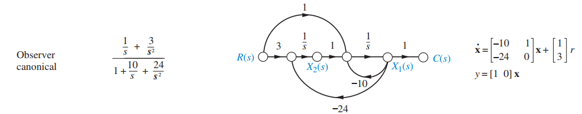

# 5.6 Signal-Flow Graphs of State Equations
<!--more-->

P254 of edition 7 book
Forms:
1. Phase variable
2. Cascade
3. Parallel
4. Controller canonical
5. Observer canonical

$$
G(s) = \frac{b_m s^m + ... + b_0}{s^n + a_{n-1} s^{n-1} + ... + a_0 }
$$

## Phase variable

define $X_1(s) \equiv R(s)/(s^n + a_{n-1} s^{n-1} + ... + a_0)$ \
Then define $X_2(s) = sX_1(s),\cdots, X_{n}(s)=sX_{n-1}(s)$\
So $X_{k}(s) = s^{k-1} X_1(s)$

then
$$
R(s) = (s^n + a_{n-1} s^{n-1} + ... + a_0)X_1(s)\\
=sX_n(s) + (a_{n-1}X_n(s) + ... + a_0 X_1(s))
$$
rearrange it
$$
sX_{k}(s) = X_{k+1}(s)\\
sX_n(s) = -(a_0X_1(s) + ... + a_{n-1} X_n(s)) + R(s)
$$
Moreover
$$
C(s) = (b_m s^m + ... + b_0)X_1(s)\\
= b_m X_{m+1}(s) + ... + b_0 X_1(s)
$$
So 
$$
A=
\begin{bmatrix}
0 & 1 &  0 & \cdots & 0\\
0 & 0 &  1 & \cdots & 0\\
\vdots & \vdots & \vdots & \vdots & \vdots\\
0 & 0 &  0 & \cdots & 1\\
-a_0 & -a_1 & -a_2 & \cdots & -a_{n-1}
\end{bmatrix}
B = 
\begin{bmatrix}
0\\ 0\\ \vdots\\ 0\\ 1
\end{bmatrix}
\\
C = 
\begin{bmatrix}
b_0 & \cdots & b_{m+1} & \cdots & 0
\end{bmatrix}
$$
and $\dot{X} = AX + Br, 
Y = CX$

## Cascade

$$
G(s) = \prod \frac{1}{s-s_k} \prod \frac{s-p_k}{s-s_k} * K
$$
define $X_n(s) = R(s) \frac{1}{s-s_n}$, here $sX_n(s) = s_n X_n(s) + R(s)$

define $A_k(s) = A_{k+1}(s) \frac{s-p_k}{s-s_k}$

moreover
$$
A_{k+1}(s) + s_k X_k(s) = sX_k(s)\\
sX_k(s) - p_kX_k(s) = A_k(s)
$$

so
$$
sX_k(s) = p_kX_k(s) + A_k(s)\\
= p_kX_k(s) + (s-s_{k-1})X_{k-1}(s)\\
s[X_k(s)-X_{k-1}(s)] = p_kX_k(s) -s_{k-1}X_{k-1}(s)
$$

## Parallel

$$
G(s) = \sum \frac{t_k}{s- s_k}
$$
then define $X_k(s) \equiv R(s)\frac{t_k}{s- s_k}$

so
$$
sX_k(s) = s_kX_k(s) + t_kR(s)\\
Y(s) = \sum X_k(s)
$$

## Controller canonical

reverse $X_1, ..., X_n$ to $X_n,..., X_1$\
So the matrix $A$ is flipped across the main diagonal 
$$
A=
\begin{bmatrix}
-a_{n-1} & \cdots & -a_2 & -a_1  & -a_0\\
1 & 0 & \cdots & 0 & 0\\
0 & 1 & \cdots & 0 & 0\\
\vdots & \vdots & \vdots & \vdots & \vdots\\
0 & 0 &  \cdots & 1 & 0\\
\end{bmatrix}
B = 
\begin{bmatrix}
1\\ 0\\ \vdots\\ 0\\ 0
\end{bmatrix}
\\
C = 
\begin{bmatrix}
0 & 0 & \cdots & b_{m+1} & \cdots& b_0
\end{bmatrix}
$$
and $\dot{X} = AX + Br, 
Y = CX$

## Observer canonical

reverse $C(s)\Leftrightarrow R(s)$\
reverse $X\Leftrightarrow \dot{X}$\
change direction of arrows
$$
G(s) = C(sI-A)^{-1}B\\
=G(s)^T = B^T(sI-A^T)^{-1}C^T
$$

So here $A \Leftarrow A^T$\
$B \Leftarrow C^T$\
$C \Leftarrow B^T$\
So
$$
A=
\begin{bmatrix}
-a_{n-1} & 1 & 0 & 0  & 0\\
-a_{n-2} & 0 & 1 & 0 & 0\\
\vdots & \vdots & \vdots & \vdots & \vdots\\
-a_1 & 0 &  \cdots & 0 & 1\\
-a_0 & 0 &  \cdots & 0 & 0\\
\end{bmatrix}
B = 
\begin{bmatrix}
0\\ 0\\ \vdots\\ b_{m+1}\\ \vdots\\b_0
\end{bmatrix}
\\
C = 
\begin{bmatrix}
1& 0& \cdots& 0& 0
\end{bmatrix}
$$
and $\dot{X} = AX + Br, 
Y = CX$
